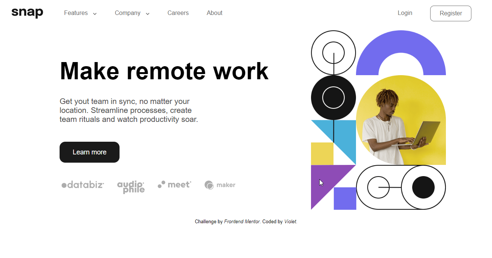
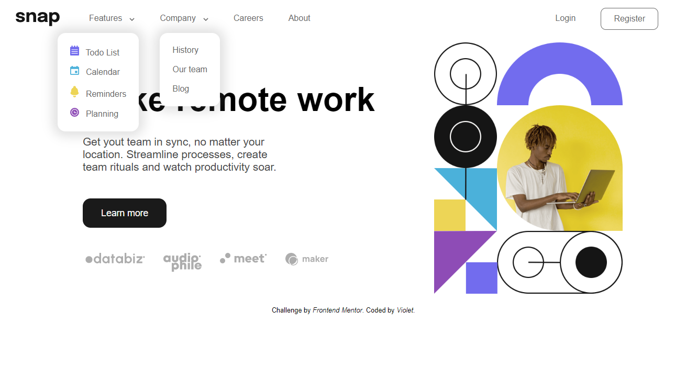
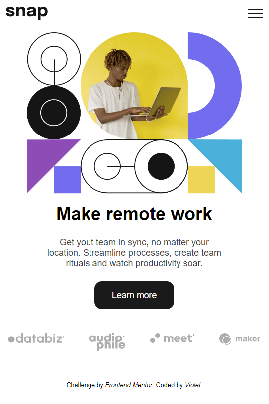

# Snap - Make remote work (Frontend Mentor Project)

This is a solution to the [Intro section with dropdown navigation challenge on Frontend Mentor](https://www.frontendmentor.io/challenges/intro-section-with-dropdown-navigation-ryaPetHE5).

- [Live preview 💻]( https://grinushka.github.io/snap-FrontendMentor/)

### The challenge

Users should be able to:
- View relevant dropdown menus on desktop and mobile when interacting with the navigation links
- View optimal layout for the content depending on their device's screen size
- See hover states for all interactive elements on the page

### Screenshots

## My process

### Built with

- Semantic HTML5 markup
- CSS custom properties
- Flexbox
- CSS Grid
- Mobile-first workflow

## Acknowledgments

- [Lots of challanges to improve your frontend skills](https://www.frontendmentor.io/)
- [What would we do without you, Stackoverflow?](https://stackoverflow.com/)

## Badges

&nbsp;

&nbsp;